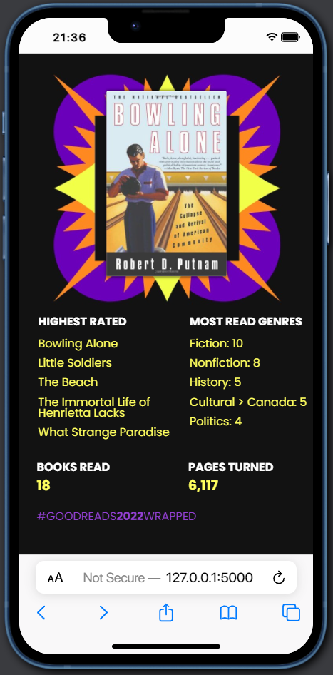

## Goodreads Wrapped

Get your year in books review. Spotify style!

## Screenshots
Provide User ID             |  GoodReads Wrapped Summary
:-------------------------:|:-------------------------:
  |  

## Installation

1. ``` git clone https://github.com/StevenAdema/goodreads-wrapped.git ```
2. ``` pip install -r requirements.txt ```
3. ```env\Scripts\activate```
4. ```python app.py```
5. Open http://127.0.0.1:5000/ in the browser

### How it works
1. A user submits their Goodreads User ID.
2. get_my_books.py scrapes the user history to get:
      1. all books completed in the past year.
      2. book meta data (isbn, cover, author, avg. rating,...)
      3. personal book data (date started & finished, user rating,...)
      4. calculated aggregate data (total books read, total pages, most common genres,...)
3. A JSON of the data is stored and a DataFrame with the data is passed to the /blunders.html template.
4. blunders.html renders the reading data to display a summary of some interesting information from the past year.

## 🙏Credit
Much of the book metadata scraping has been directly sourced or adapted from code written by Maria Antoniak and Melanie Walsh in https://github.com/maria-antoniak/goodreads-scraper which is under under a GNU General Public License v3.0.